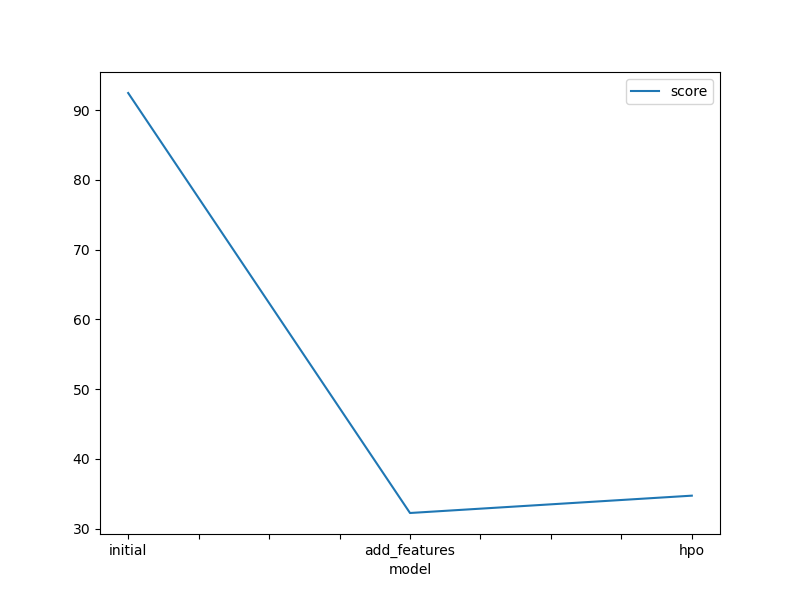
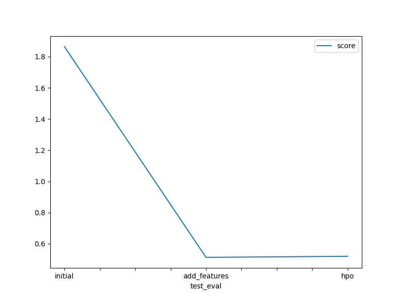

# Report: Predict Bike Sharing Demand with AutoGluon Solution
#### Abhishek Banait

## Initial Training
### What did you realize when you tried to submit your predictions? What changes were needed to the output of the predictor to submit your results?
When I first tried to submit the predictions, I noticed that I needed to set all the negative values to zero before submission. I checked for overall description of predictions and found no negative values and thus I proceeded without any changes. I however, noticed that the squared error was high (92.44) and also my model score on kaggle wasn't good enough. Thus, I had to do feature engineering and set negative predictions to zero to get better scores.

### What was the top ranked model that performed?
My top ranked model was the 'WeightedEnsemble_L2'

## Exploratory data analysis and feature creation
### What did the exploratory analysis find and how did you add additional features?
The EDA helped me get an idea of the distribution of various features. I then created features hour, day, month and year from datetime feature accordingly.
### How much better did your model preform after adding additional features and why do you think that is?
After adding these features, my model performed exceptionally well. The kaggle score came to 0.51296 while the rmse was reduced to 32.23
## Hyper parameter tuning
### How much better did your model preform after trying different hyper parameters?
After hyper parameter tuning, the performance did not change drastically. A slight increase in the kaggle score and rmse(34.71) was seen. The model performed almost similar to previous one.
### If you were given more time with this dataset, where do you think you would spend more time?
Definetly, I would have used some more EDA and find much relevant features on which I would have trained the model. Also, I would have used some more hyper parameters to eventually increase the performance of the model.
### Create a table with the models you ran, the hyperparameters modified, and the kaggle score.
|model|hpo1|hpo2|hpo3|score|
|--|--|--|--|--|
|initial|default_value|default_value|default_value|1.86412|
|add_features|default_value|default_value|default_value|0.51296|
|hpo|GBM: {(num_boost_round: lower=100, upper=800), (num_leave: lower=26, upper=66)}|XGB: {(max_depth: lower=5, upper=8), (n_estimators: lower=100, upper=500), (eta=0.3), (subsample: 1), (colsample_bytree:1)|rf: (criterion: squared_error)|0.5198|

### Create a line plot showing the top model score for the three (or more) training runs during the project.

TODO: Replace the image below with your own.

### Create a line plot showing the top kaggle score for the three (or more) prediction submissions during the project.

TODO: Replace the image below with your own.

## Summary
This project aims to predict bike rental demands to help bike sharing operators to improve customer satisfaction and increase their efficiency.
In this project, I have built a bike sharing demand prediction model using AutoGluon. The data was collected from kaggle in train, test and submission files. Using this data I trained the AutoGluon's TabularPredictor model and got a rmse of 92.44 and kaggle score of 1.86. I then performed EDA, feature engineering and hyper parameter optimization and got a final rmse of 34.71 and kaggle score of 0.5198.
